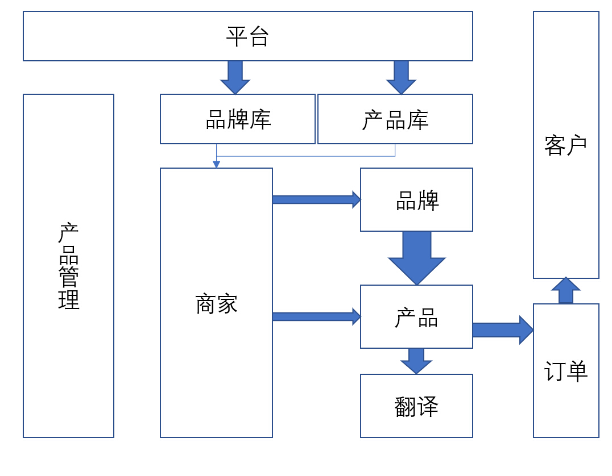
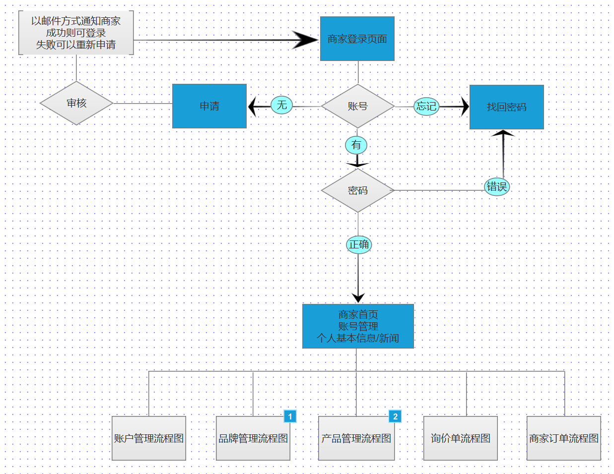
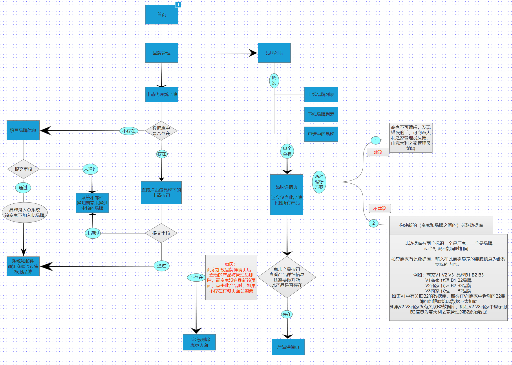
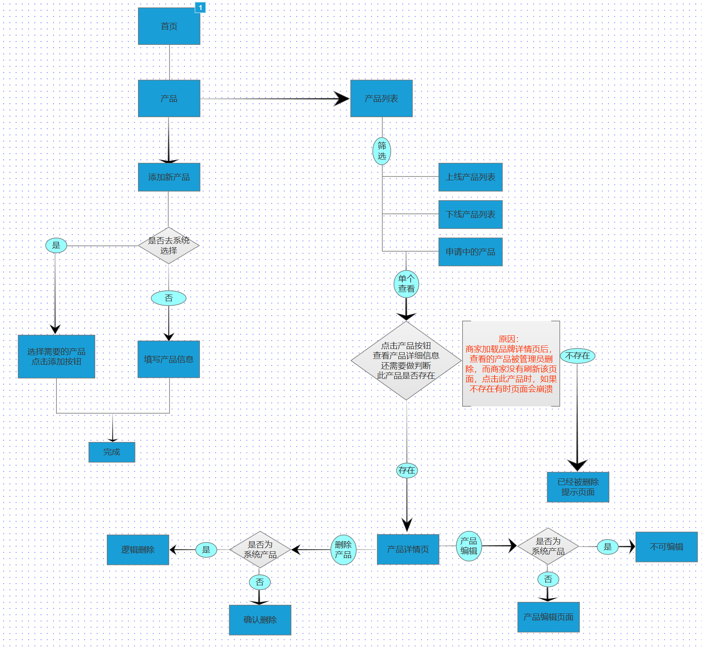
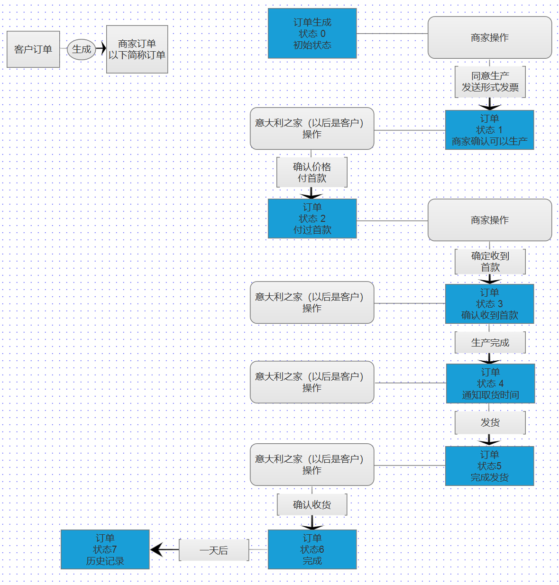

## [返回目录](../readme.md)  

### 4. 产品架构  &nbsp;&nbsp;&nbsp;&nbsp; [<<上一章（产品简介）](./3_Description.md) [下一章（详细功能）>>](./5_Function.md)

#### 4.1 信息结构图

#### 4.2 商家登录流程图

#### 4.3 品牌管理流程图

#### 4.4 产品管理流程图

#### 4.5 订单状态图

